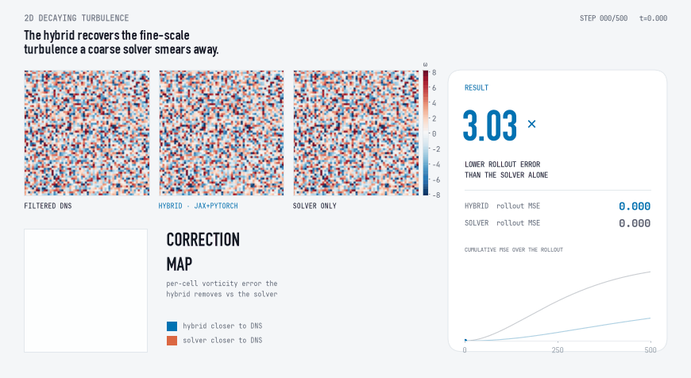
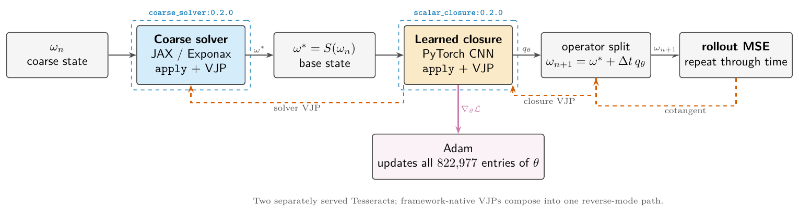
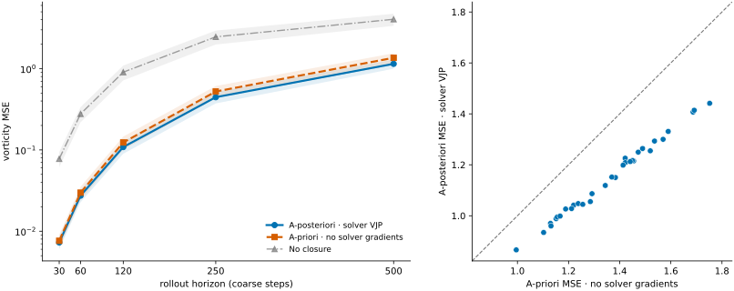
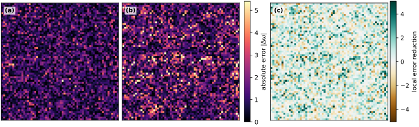
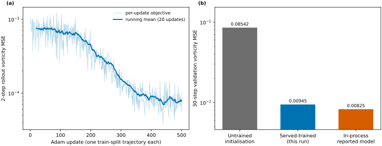
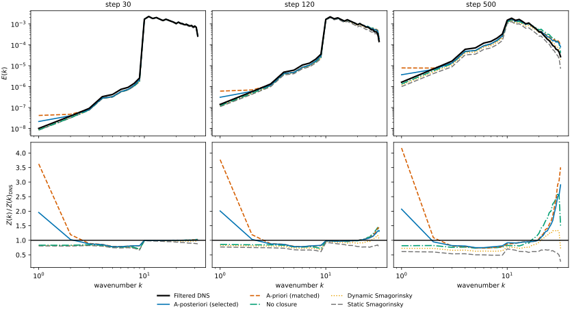
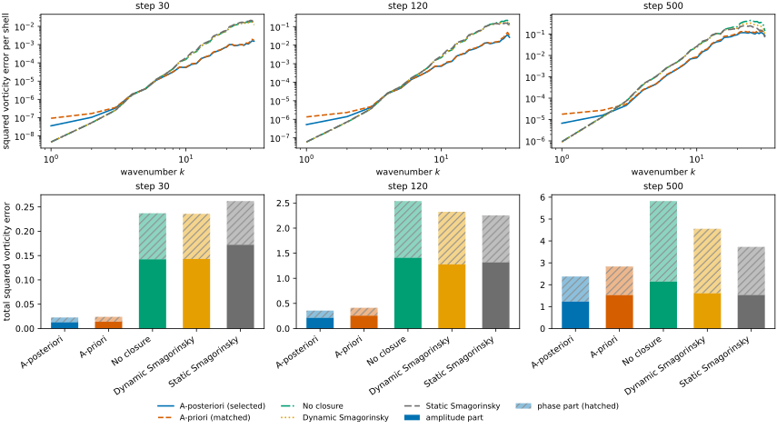

# Differentiable hybrid closure for two-dimensional turbulence

[](https://pasteurlabs.ai/tesseract-hackathon-2026/)
[](https://github.com/pasteurlabs/tesseract-core)
[](https://github.com/pasteurlabs/tesseract-jax)
[](https://www.python.org/)
[](LICENSE)
[](https://github.com/julian-8897/tesseract-hybrid-closure/actions/workflows/ci.yml)
[](https://julian-8897.github.io/tesseract-hybrid-closure/)

A PyTorch closure corrects a JAX/Exponax spectral solver, with reverse-mode gradients composed across two Tesseracts. On 32 locked test trajectories, a-posteriori training reduces 500-step rollout vorticity MSE by **71.7%** relative to the solver alone and by **15.7%** relative to a matched a-priori CNN.

Submission for Track 3: Hybrid ML + mechanistic models. The application setting is coarse-grid turbulence closure: large-eddy simulation and coupled models parameterise subgrid-scale physics, and learned closures trained a-posteriori through the solver are an active line of work (Frezat et al., 2022; Guan et al., 2022).

<p align="center">
  
</p>

The animation shows locked test seed 20000 over the full 500-step rollout. The top row is the filtered DNS, the hybrid (JAX solver + PyTorch closure) and the mechanistic solver alone, on one shared vorticity scale. The correction map is the signed per-cell error the hybrid removes relative to the solver: blue where the hybrid is closer to DNS, vermillion where the solver is. The card reports the cumulative rollout vorticity MSE for each method and their ratio, and the sparkline traces that MSE over the rollout. Display colour limits use the pooled 98.5th percentile for legibility; clipping is visual only, while the reported rollout vorticity MSE uses every cell and time.

> **Start here.** Open the zero-install [interactive visual walkthrough](https://julian-8897.github.io/tesseract-hybrid-closure/), then read the four-page [technical writeup](docs/TECHNICAL_WRITEUP.pdf). Every reported experimental result is recomputable from the tracked reports in `docs/results/`. To verify the submitted checkpoint on one held-out seed:
> - [Download the exact submitted parameters](https://github.com/julian-8897/tesseract-hybrid-closure/releases/tag/submission-2026-08-31) (SHA-256 `8ed5b36f…`), then run one held-out seed (~1 min, no Docker):
>
>   ```sh
>   uv run hybrid-closure evaluate --checkpoint stage-unroll-30-updates-700.pkl \
>     --split validation --seeds 10000 --unroll 30
>   ```
>
> - `uv sync --locked && make verify`: compile, lint, the full unit suite, the cross-framework gradient smoke and the rollout smokes.
> - `make build-tesseracts && make container-smoke`: builds the two Tesseract images and differentiates a two-step rollout loss through the served containers into all 822,977 closure parameters.
>
> `docs/VERIFICATION.md` records completed runs and measured values, including defects found by review and fixed.

## Main results

- **Trajectory accuracy:** 71.7% lower 500-step MSE than no closure; 15.7% lower than the matched a-priori CNN.
- **Paired comparison:** the a-posteriori model wins on all 32 test seeds at every reported horizon.
- **Stability:** every evaluated trajectory remains finite through 500 steps.
- **Cross-framework differentiation:** one Adam step produces a finite gradient vector covering all 822,977 transported CNN parameters via the solver and closure VJPs.
- **Served optimisation:** a separate 500-update run through the two images reduces 30-step validation MSE from `0.085425` to `0.009446`; the submitted in-process checkpoint scores `0.008248` on the same eight seeds.

The submitted checkpoint was trained through the in-process transport for throughput. The served runs exercise the same component and VJP boundary under shorter demonstration objectives and are not used in model selection or test evaluation.

## Method

For coarse vorticity `ωₙ`, one hybrid step is

```text
ω*      = S_JAX(ωₙ; Δt)
qθ      = C_Torch(ω*; θ)
ωₙ₊₁    = ω* + Δt qθ.
```

`S_JAX` is an Exponax ETDRK2 step. `C_Torch` is a ten-layer periodic CNN that predicts a scalar vorticity tendency. States are float32 arrays with shape `(1, 64, 64)`; `θ` contains 822,977 flattened parameters.

| Tesseract | Image | Framework | Differentiable contract |
|---|---|---|---|
| Coarse solver | `coarse_solver:0.2.0` | JAX/Exponax | `omega → omega_next`; JVP and VJP |
| Scalar closure | `scalar_closure:0.2.0` | PyTorch | `(omega, params_flat) → tendency`; VJP |

Terminology used below: DNS is direct numerical simulation, the fine reference solver; ETDRK2 is the second-order exponential time-differencing scheme; VJP and JVP are vector-Jacobian and Jacobian-vector products, reverse- and forward-mode differentiation; a cotangent is the gradient flowing back through one step. Both Tesseracts also expose `abstract_eval`, which infers shapes and dtypes without running the kernel; the solver adds forward-mode JVP, which the closure does not need.

<p align="center">
  
</p>

During reverse mode, the closure endpoint uses PyTorch autograd to return VJPs with respect to its input and parameters. The solver endpoint uses `jax.vjp` to propagate the state cotangent through Exponax. `tesseract-jax` composes both operations into the rollout objective. No finite-difference gradient or surrogate backward model is used.

The diagram is available as editable [TikZ](docs/figures/fig_tesseract_gradient_path.tex) and vector [PDF](docs/figures/fig_tesseract_gradient_path.pdf). The [complete training and deployment diagram](docs/figures/fig_hybrid_closure_method.svg) is provided separately.

### Why Tesseract

Without this component boundary, the practical alternatives were a monolithic program that couples the two frameworks' dependency trees and reimplements one component in the other's language, or a hand-written AD tape across the boundary that neither framework owns. Here each component keeps its native framework, dependencies and container, exposes a typed, inspectable derivative contract, and can be instrumented, versioned and replaced without rewriting the other. The reverse path of record implements the same reverse-mode composition training uses: the solver's VJP is `jax.vjp` through Exponax, the closure's VJP is PyTorch autograd over the flattening, and `tesseract-jax` composes them into one objective.

### Why the solver VJP matters

That path is measured, not assumed: zeroing the solver VJP's `omega` cotangent changes a two-step parameter gradient by 39.98% relative, so the solver transpose contributes materially to the parameter gradient. The measurement is pinned at 0.3998 in `tests/test_tesseract_composition.py` and re-measured through the images ([`docs/results/container-optimiser-demo.json`](docs/results/container-optimiser-demo.json)). The matched a-priori baseline fits an instantaneous tendency target without solver gradients. A-posteriori training minimises

```text
L_H(θ) = (1 / (H × 64²)) Σₜ₌₁ᴴ ||ω̂ₜ(θ) − ω̄ₜ^DNS||²₂.
```

For `H > 1`, an early closure prediction affects every later solver state. The matched CNNs share architecture, initialisation, optimiser, update budget, training seeds and flow configuration; they differ in objective. Their test comparison therefore measures the benefit of trajectory-aware optimisation in this setting, not a general property of all a-priori closures.

## Locked evaluation

Every choice below was fixed before any test evaluation, so the reported numbers are out-of-sample. The test split is opened once, at the end of the protocol.

- `256²` Exponax DNS, sharply filtered to `64²` coarse truth.
- Mean-zero Gaussian initial conditions with radial modes `10 ≤ |k| ≤ 32`, rescaled to `|ω|ₘₐₓ = 20`.
- Float32 ETDRK2, `ν = 10⁻³`, `Δt = 0.002`.
- A-posteriori curriculum `1 → 5 → 30`; Adam at `10⁻⁴`; 700 updates.
- Disjoint seeds: train `0–9999`, validation `10000–10031`, test `20000–20031`.
- Model selection on mean 30-step validation MSE before test access.
- One 500-step test rollout per seed; shorter horizons are prefixes of the same trajectory.



Markers show the 32-seed mean and bands show ±1 population standard deviation. Every point in the paired panel falls below the equal-error line at 500 steps.

| Method | 30 steps | 60 steps | 120 steps | 250 steps | 500 steps |
|---|---:|---:|---:|---:|---:|
| **A-posteriori CNN** | **0.007280 ± 0.001265** | **0.02742 ± 0.00471** | **0.1086 ± 0.0188** | **0.4458 ± 0.0722** | **1.1468 ± 0.1480** |
| A-priori CNN, matched | 0.007622 ± 0.001399 | 0.02980 ± 0.00543 | 0.1235 ± 0.0225 | 0.5234 ± 0.0887 | 1.3602 ± 0.1873 |
| No closure | 0.07776 ± 0.01658 | 0.2777 ± 0.0589 | 0.9048 ± 0.1883 | 2.4622 ± 0.4794 | 4.0516 ± 0.6886 |
| Dynamic Smagorinsky | 0.07796 ± 0.01653 | 0.2723 ± 0.0571 | 0.8541 ± 0.1737 | 2.1910 ± 0.4103 | 3.3942 ± 0.5443 |
| Static Smagorinsky, `Cₛ=0.17` | 0.08806 ± 0.01826 | 0.2956 ± 0.0602 | 0.8682 ± 0.1705 | 2.0365 ± 0.3661 | 2.9443 ± 0.4548 |

The metric averages squared vorticity error over all states in the rollout prefix and all `64²` cells. Exact aggregate and per-seed values, paired wins, protocol details and source hashes are in [`docs/results/final-metrics.json`](docs/results/final-metrics.json).



For the predeclared seed at step 500, panels show hybrid absolute error, solver-only absolute error on the same scale, and their signed difference. Positive green regions are local improvements; brown regions are local regressions. Display limits use the 99.5th percentile for legibility; reported MSE uses every cell without clipping.

## Evidence through the served images

The image-backed demonstration differentiates a two-step rollout loss through `coarse_solver:0.2.0` and `scalar_closure:0.2.0`, then applies one Adam update.

| Quantity | Verified value |
|---|---:|
| Loss | `0.0008655003 → 0.0008654960` |
| Gradient | 822,977 finite entries |
| Solver VJP calls | `1` |
| Closure VJP calls | `2` |
| Parameter update norm | `0.00462866` |
| Solver-transpose sensitivity | `0.3998` (image-backed) |

The full report is [`docs/results/container-optimiser-demo.json`](docs/results/container-optimiser-demo.json).



A separate run performs 500 Adam updates with every training forward evaluation and VJP crossing the two images. It uses one fresh train-split trajectory per update and a fixed two-step objective. The resulting model reduces 30-step MSE by 88.9% on validation seeds `10000–10007` and stays within 15% of the submitted checkpoint on those seeds. The run does not touch the test split.

| | Submitted model | Served training run |
|---|---|---|
| Purpose | Headline results in this README | Deployment-boundary demonstration |
| Transport | In-process JAX/PyTorch callback and explicit VJP | Two served container images over HTTP |
| Objective | Curriculum `1 → 5 → 30`, 700 updates | Fixed 2-step unroll, 500 updates |
| Seeds | train `0–9999` | one fresh train-split trajectory per update |
| Evidence | `final-metrics.json` | `served-training.json` |

The tracked report is [`docs/results/served-training.json`](docs/results/served-training.json): it records per-seed validation values, image IDs, the git commit and dirty state, the trained checkpoint's SHA-256, and 500 solver / 1,000 closure VJP calls. [`docs/VERIFICATION.md`](docs/VERIFICATION.md) records the commands and known reproducibility limits.

The served transport also carries the headline objective. A further run trains 100 updates at the locked 30-step unroll, the final curriculum stage's length, entirely through the two images: 30-step validation MSE falls from `0.085425` to `0.036354` (57.4%) on the same eight seeds, with 2,900 solver and 3,000 closure VJP calls and every gradient finite. The 700-update in-process model scores `0.008248` on those seeds. The record is [`docs/results/served-training-30unroll.json`](docs/results/served-training-30unroll.json).

<details>
<summary><strong>Validation diagnostics: spectra and endpoint error decomposition</strong></summary>

### Spectral agreement

Radially binned energy and enstrophy spectra are measured on all 32 validation seeds. The mean absolute log-ratio weights shells `1 ≤ k ≤ 32` equally. No diagnostic contributes to model selection or test evaluation.



The a-posteriori model is closer to filtered DNS than the matched a-priori model at all three steps. Dynamic Smagorinsky has the lowest step-500 enstrophy log-distance (`0.2787` against `0.3019`), despite substantially worse pointwise error. Spectral shape and trajectory accuracy therefore separate at long rollout.

### Endpoint amplitude and phase

For one model coefficient `a` and reference coefficient `b`,

```text
|a − b|² = (|a| − |b|)² + 2|a||b|(1 − cos(arg a − arg b)).
```

Averaging these terms over seeds and summing all Fourier shells decomposes the **endpoint field MSE at each requested step**. It does not decompose the rollout-prefix metric in the table above.



At step 500, the a-posteriori endpoint error has amplitude and phase contributions `1.2297` and `1.1461`. Against dynamic Smagorinsky these are 23.8% and 61.1% lower, respectively. Against the matched a-priori CNN they are 19.6% and 12.1% lower. These measurements support a phase-alignment interpretation against the classical baselines, while the matched-CNN difference is mainly amplitude.

Reproduce both diagnostics with `make spectra`, `make spectra-figure` and `make decomposition-figure`. Exact shell values and checkpoint hashes are in [`docs/results/spectra-validation.json`](docs/results/spectra-validation.json).

</details>

## Quickstart

Requirements: Python 3.13, [`uv`](https://docs.astral.sh/uv/), and Docker plus the `tesseract-core` CLI for image-backed commands. `make verify` takes about a minute on a laptop; `make build-tesseracts` needs Docker with a few GB free.

```sh
uv sync --locked
make verify
```

`make verify` runs compilation, Ruff checks, unit tests, the single-step cross-framework gradient smoke, and the rollout-gradient and curriculum smokes. The same gate runs in GitHub Actions.

### Interactive visual walkthrough

[**Open the zero-install browser walkthrough →**](https://julian-8897.github.io/tesseract-hybrid-closure/)

The deployed marimo app uses a precomputed 30-step validation trajectory, so its vorticity fields, rollout errors, energy spectra and enstrophy spectra react immediately in the browser. The data are generated deterministically by `scripts/generate_notebook_demo_data.py` from the digest-verified submitted checkpoint.

For the fully reproducible live path, generate the DNS reference and both rollouts locally:

```sh
# The submitted checkpoint must exist at the default path shown below, or enter
# its downloaded path in the notebook. See the release command in the next section.
make notebook
```

The browser data are tracked and regenerable: the generator verifies the
submitted checkpoint's SHA-256 and refuses to overwrite an existing output set.
To regenerate the fields and metadata, first remove the four tracked files under
`notebooks/public/`, then run:

```sh
uv run python scripts/generate_notebook_demo_data.py
```

The Pages workflow (`.github/workflows/pages.yml`) re-exports and deploys the
browser walkthrough on every push that touches the notebook or its data.

Both walkthroughs use validation seeds only. They do not retrain the closure, access the sealed test split, require Docker, or alter the locked numerical configuration.

```sh
make build-tesseracts
make container-smoke
uv run hybrid-closure demo --images \
  --output artifacts/container-optimiser-demo.json
```

<details>
<summary><strong>Training and held-out evaluation</strong></summary>

The exact submitted parameters are published as a [GitHub release asset](https://github.com/julian-8897/tesseract-hybrid-closure/releases/tag/submission-2026-08-31); no training is needed to reproduce the headline numbers:

```sh
# Download the exact submitted a-posteriori checkpoint (SHA-256
# 8ed5b36f…) and run one 30-step validation seed (~1 min).
curl -L -o stage-unroll-30-updates-700.pkl \
  https://github.com/julian-8897/tesseract-hybrid-closure/releases/download/submission-2026-08-31/stage-unroll-30-updates-700.pkl
shasum -a 256 stage-unroll-30-updates-700.pkl   # 8ed5b36fac902e61…
uv run hybrid-closure evaluate --checkpoint stage-unroll-30-updates-700.pkl \
  --split validation --seeds 10000 --unroll 30
```

The matched a-priori checkpoint is the second release asset (`checkpoint.pkl`, SHA-256 `8862fbd5…`). Retraining from scratch:

```sh
# Reproduce both candidates from the fixed initialisation. Retraining takes
# on the order of an hour of CPU per candidate; the tracked reports under
# docs/results/ already contain every headline and per-seed number, so
# these commands are for provenance, not a prerequisite.
uv run hybrid-closure train \
  --updates-per-stage 100 100 100 --dt 0.002 \
  --vorticity-amplitude 20 \
  --output-dir runs/reproduce-aposteriori-300
uv run hybrid-closure train \
  --updates-per-stage 100 100 500 --dt 0.002 \
  --vorticity-amplitude 20 \
  --output-dir runs/reproduce-aposteriori-700

# Select candidates on validation only.
uv run hybrid-closure final --stage select \
  --selection-output runs/reproduce-final/selection.json \
  --candidate aposteriori-300:runs/reproduce-aposteriori-300/stage-unroll-30.pkl \
  --candidate aposteriori-700:runs/reproduce-aposteriori-700/stage-unroll-30.pkl

# Train the matched a-priori baseline, then open the held-out test split once.
uv run hybrid-closure final --stage apriori evaluate \
  --selection-output runs/reproduce-final/selection.json \
  --apriori-output-dir runs/reproduce-final/apriori-700 \
  --evaluation-output runs/reproduce-final/test-evaluation.json \
  --split test
```

Do not rerun the test stage for model choice. The preserved source reports and checkpoints are gitignored; their paths and SHA-256 digests are recorded in the tracked metrics file. The tracked reports are self-contained: every aggregate, per-seed error and source digest is in `docs/results/` without any checkpoint.

</details>

## Limitations

- Results cover one freely decaying two-dimensional regime. Transfer to forced, stationary or three-dimensional turbulence is untested.
- The scalar tendency closure has no explicit conservation or dissipativity guarantee.
- Optimisation uses vorticity MSE only. Spectra are diagnostic; no spectral loss is implemented.
- Smagorinsky baselines use fixed formulations rather than tuned coefficients.

## Repository map

- `Makefile`: the verification gate (`make verify`) and the reproduction, diagnostic and figure targets.
- `scripts/`: deterministic generators for the tracked reports and figures.
- `notebooks/browser_walkthrough.py`: zero-install browser walkthrough deployed to GitHub Pages from precomputed validation data.
- `notebooks/visual_walkthrough.py`: live marimo walkthrough that regenerates the demo from the submitted checkpoint.
- `src/tesseract_hybrid_closure/`: solver, closure, VJP bridge, training and evaluation.
- `tesseracts/`: the JAX coarse solver and PyTorch closure components.
- `docs/VERIFICATION.md`: measured runs, checks and known defects.
- `docs/results/`: tracked metrics and diagnostic reports; self-contained without checkpoints.
- `docs/figures/`: generated figures and editable diagram sources.
- `runs/` and `artifacts/`: gitignored provenance (checkpoints, run reports, smoke outputs) referenced by path and SHA-256 from `docs/results/`.

## References

1. Frezat, H., Le Sommer, J., Fablet, R., Balarac, G. & Lguensat, R. *A posteriori learning for quasi-geostrophic turbulence parametrization*. Journal of Advances in Modeling Earth Systems (2022). [arXiv:2204.03911](https://arxiv.org/abs/2204.03911), [doi:10.1029/2022MS003124](https://doi.org/10.1029/2022MS003124).
2. Guan, Y., Chattopadhyay, A., Subel, A. & Hassanzadeh, P. *Stable a posteriori LES of 2D turbulence using convolutional neural networks: Backscattering analysis and generalization to higher Re via transfer learning*. Journal of Computational Physics **458**, 111090 (2022). [arXiv:2102.11400](https://arxiv.org/abs/2102.11400), [doi:10.1016/j.jcp.2022.111090](https://doi.org/10.1016/j.jcp.2022.111090).
3. Shankar, V. et al. *Differentiable turbulence*. [arXiv:2307.03683](https://arxiv.org/abs/2307.03683).
4. Köhler, F. *From Numerical Simulators of PDEs to Neural Emulators and Back*. PhD thesis, Technical University of Munich (2026). [arXiv:2608.24547](https://arxiv.org/abs/2608.24547).
5. Germano, M., Piomelli, U., Moin, P. & Cabot, W. H. *A dynamic subgrid-scale eddy viscosity model*. Physics of Fluids A **3**, 1760–1765 (1991). [doi:10.1063/1.857955](https://doi.org/10.1063/1.857955).
6. Lilly, D. K. *A proposed modification of the Germano subgrid-scale closure method*. Physics of Fluids A **4**, 633–635 (1992). [doi:10.1063/1.858280](https://doi.org/10.1063/1.858280).

## Licence and provenance

Licensed under [Apache-2.0](LICENSE), with copyright attributions in [NOTICE](NOTICE). The repository structure and Tesseract endpoint pattern were adapted from an earlier Apache-2.0 project; see [ATTRIBUTION.md](ATTRIBUTION.md).

The DNS reference and coarse solver use [Exponax](https://github.com/Ceyron/exponax) `NavierStokesVorticity` 0.2.0 by Felix Köhler under the MIT licence. The Smagorinsky baselines follow the Germano–Lilly dynamic subgrid procedure (Germano et al., 1991; Lilly, 1992) specialised to the 2D vorticity equation, with a 2× spectral test filter, global averaging and zero-clipped coefficients.
